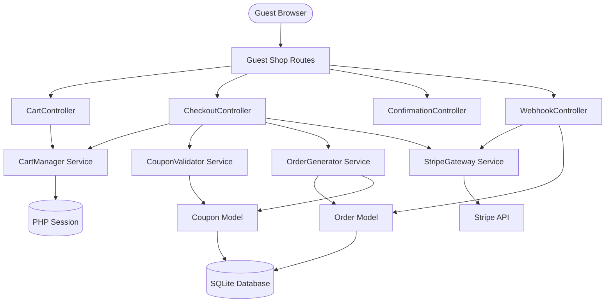
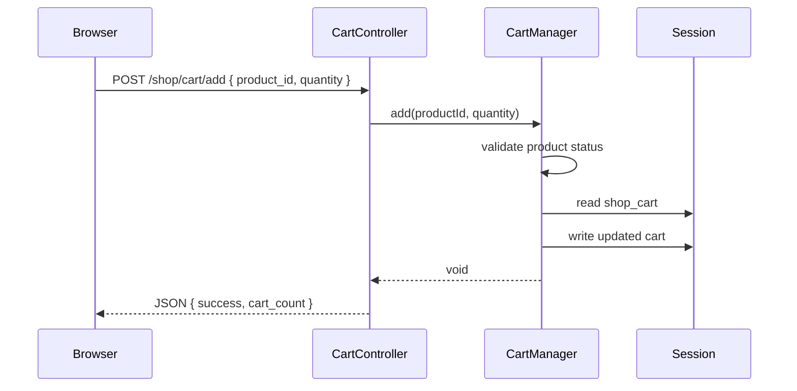
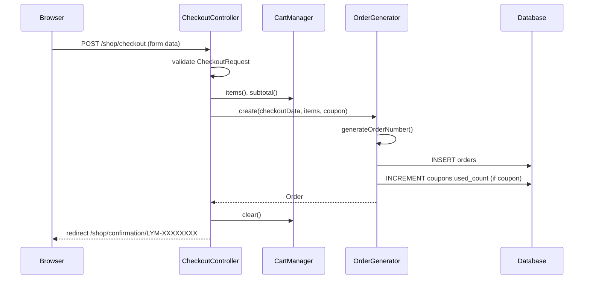
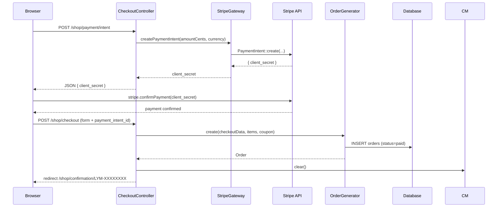
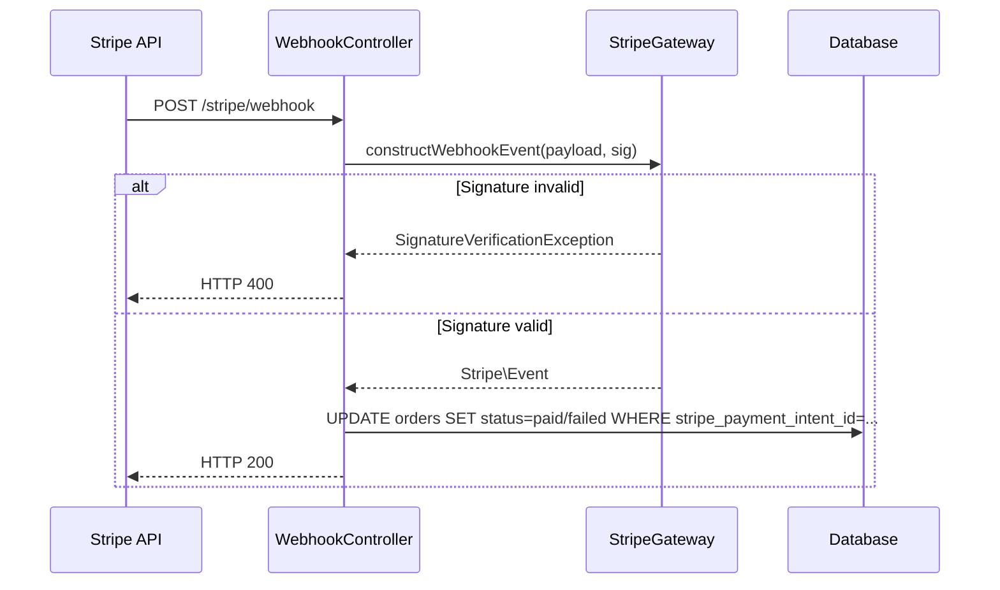

# Design Document: Guest Cart & Checkout

## Overview

This feature adds a complete guest (non-authenticated) e-commerce flow to the existing Laravel 12 application. Guests can browse products, manage a session-based cart, apply discount coupons, fill in shipping details, and pay via Cash on Delivery or Stripe — all without creating an account. Orders are persisted to the database with a unique `LYM-XXXXXXXX` order number, and a confirmation page is shown on success.

The implementation introduces new guest-facing routes, four service classes (`CartManager`, `CouponValidator`, `OrderGenerator`, `StripeGateway`), a new `orders` migration, a `config/shop.php` configuration file, and three Blade views under `resources/views/shop/`.

---

## Architecture




---

## Routes

All new guest routes are added to `routes/web.php` alongside the existing admin routes. The Stripe webhook endpoint is excluded from CSRF protection via the `VerifyCsrfToken` middleware exception list.

```php
// routes/web.php additions

// Guest Shop Routes (no auth required)
Route::prefix('shop')->name('shop.')->group(function () {

    // Cart
    Route::get('/cart', [CartController::class, 'index'])->name('cart');
    Route::post('/cart/add', [CartController::class, 'add'])->name('cart.add');
    Route::patch('/cart/update', [CartController::class, 'update'])->name('cart.update');
    Route::delete('/cart/remove', [CartController::class, 'remove'])->name('cart.remove');

    // Checkout
    Route::get('/checkout', [CheckoutController::class, 'index'])->name('checkout');
    Route::post('/checkout', [CheckoutController::class, 'store'])->name('checkout.store');

    // Coupon (AJAX)
    Route::post('/coupon/apply', [CheckoutController::class, 'applyCoupon'])->name('coupon.apply');
    Route::delete('/coupon/remove', [CheckoutController::class, 'removeCoupon'])->name('coupon.remove');

    // Stripe PaymentIntent (AJAX)
    Route::post('/payment/intent', [CheckoutController::class, 'createPaymentIntent'])->name('payment.intent');

    // Confirmation
    Route::get('/confirmation/{orderNumber}', [ConfirmationController::class, 'show'])->name('confirmation');
});

// Stripe Webhook (excluded from CSRF)
Route::post('/stripe/webhook', [WebhookController::class, 'handle'])->name('stripe.webhook');
```

**CSRF exception** — add to `app/Http/Middleware/VerifyCsrfToken.php`:
```php
protected $except = [
    'stripe/webhook',
];
```


---

## Database Schema

### New Migration: `orders` Table

File: `database/migrations/2026_XX_XX_000001_create_orders_table.php`

```php
Schema::create('orders', function (Blueprint $table) {
    $table->id();
    $table->string('order_number', 12)->unique()->index(); // e.g. LYM-MOBXGZBF
    $table->string('status', 20)->default('pending');     // pending | paid | failed

    // Contact & Shipping
    $table->string('email');
    $table->string('full_name', 100);
    $table->string('address', 255);
    $table->string('city', 100);
    $table->string('postal_code', 20);
    $table->string('country', 100);
    $table->string('phone', 20);

    // Cart snapshot (JSON)
    $table->json('items');
    // Each item: { product_id, title, image, unit_price, quantity, line_total }

    // Financials
    $table->decimal('subtotal', 10, 2);
    $table->decimal('shipping_fee', 10, 2)->default(0);
    $table->decimal('fast_production_fee', 10, 2)->default(0);
    $table->decimal('discount', 10, 2)->default(0);
    $table->string('coupon_code')->nullable();
    $table->decimal('total', 10, 2);

    // Payment
    $table->string('payment_method', 20);                 // cod | stripe
    $table->string('stripe_payment_intent_id')->nullable();

    $table->timestamps();
});
```

### Cities — Config-Based (No Separate Table)

Cities are stored in `config/shop.php` as a plain array. This avoids an extra migration and admin UI for a relatively static list. If the list needs to be dynamic in the future, a `cities` table can be added.

### No Changes to Existing Tables

The `coupons` table already has `used_count` — the `OrderGenerator` will call `$coupon->increment('used_count')` atomically. No schema changes needed.


---

## Configuration

### `config/shop.php`

```php
<?php

return [

    /*
    |--------------------------------------------------------------------------
    | Currency
    |--------------------------------------------------------------------------
    */
    'currency'         => env('SHOP_CURRENCY', 'eur'),
    'currency_symbol'  => env('SHOP_CURRENCY_SYMBOL', '€'),

    /*
    |--------------------------------------------------------------------------
    | Fees
    |--------------------------------------------------------------------------
    */
    'shipping_fee'          => env('SHOP_SHIPPING_FEE', 5.95),
    'fast_production_fee'   => env('SHOP_FAST_PRODUCTION_FEE', 9.95),

    /*
    |--------------------------------------------------------------------------
    | Cities (dropdown on checkout form)
    |--------------------------------------------------------------------------
    */
    'cities' => [
        'Amsterdam',
        'Rotterdam',
        'The Hague',
        'Utrecht',
        'Eindhoven',
        'Groningen',
        'Tilburg',
        'Almere',
        'Breda',
        'Nijmegen',
    ],

    /*
    |--------------------------------------------------------------------------
    | Order Number
    |--------------------------------------------------------------------------
    */
    'order_number_prefix'   => 'LYM',
    'order_number_length'   => 8,   // characters after the prefix-dash
    'order_number_retries'  => 10,

    /*
    |--------------------------------------------------------------------------
    | Session Keys
    |--------------------------------------------------------------------------
    */
    'cart_session_key'   => 'shop_cart',
    'coupon_session_key' => 'shop_coupon',

];
```

### `.env` additions

```dotenv
SHOP_CURRENCY=eur
SHOP_CURRENCY_SYMBOL=€
SHOP_SHIPPING_FEE=5.95
SHOP_FAST_PRODUCTION_FEE=9.95

STRIPE_KEY=pk_test_...
STRIPE_SECRET=sk_test_...
STRIPE_WEBHOOK_SECRET=whsec_...
```

The existing `config/services.php` already has a `stripe` key stub — populate it:

```php
'stripe' => [
    'key'            => env('STRIPE_KEY'),
    'secret'         => env('STRIPE_SECRET'),
    'webhook_secret' => env('STRIPE_WEBHOOK_SECRET'),
],
```


---

## Service Classes

### `CartManager` — `app/Services/CartManager.php`

Responsible for all session-based cart operations. The session key is `shop_cart`.

**Session structure:**

```php
// session('shop_cart') shape:
[
    '{product_id}' => [
        'product_id'   => int,
        'title'        => string,
        'image'        => string,   // relative storage path
        'unit_price'   => float,    // locked at time of addition
        'quantity'     => int,      // 1–99
        'line_total'   => float,    // unit_price × quantity
    ],
    // ...
]
```

**Public methods:**

```php
class CartManager
{
    // Add a product; increments quantity if already present.
    // Throws CartException if product is inactive or not found.
    // Caps quantity at 99.
    public function add(int $productId, int $quantity = 1): void

    // Update quantity for an existing item.
    // Removes item if quantity <= 0.
    // Caps quantity at 99.
    public function update(int $productId, int $quantity): void

    // Remove a single item by product ID.
    public function remove(int $productId): void

    // Return all cart items as an array.
    public function items(): array

    // Return item count (sum of all quantities).
    public function count(): int

    // Return subtotal (sum of all line_totals).
    public function subtotal(): float

    // Return true if cart has no items.
    public function isEmpty(): bool

    // Destroy the cart session key entirely.
    public function clear(): void
}
```

**Key design decisions:**
- Unit price is locked at the moment of `add()` by reading `$product->price` — subsequent price changes do not affect existing cart items.
- `add()` validates `$product->status === true` before adding; throws a `CartException` with a user-friendly message if not.
- All monetary values are stored as floats rounded to 2 decimal places.


### `CouponValidator` — `app/Services/CouponValidator.php`

Validates a coupon code and calculates the discount amount.

```php
class CouponValidator
{
    // Validate a coupon code against the given subtotal.
    // Returns a CouponResult value object on success.
    // Throws CouponException with a specific message on failure.
    public function validate(string $code, float $subtotal): CouponResult
}
```

**`CouponResult` value object:**

```php
class CouponResult
{
    public readonly string $code;
    public readonly string $type;       // percent | fixed | free_shipping
    public readonly float  $discount;   // monetary amount to deduct
    public readonly bool   $freeShipping;
}
```

**Validation logic (ordered checks):**

```
1. Look up coupon by code (case-insensitive: UPPER($code))
   → Not found: throw CouponException("Coupon code not found.")

2. Check status === true
   → false: throw CouponException("This coupon is inactive.")

3. Check isExpired() === false  (uses existing Coupon::isExpired())
   → expired: throw CouponException("This coupon has expired.")

4. Check used_count < usage_limit  (or usage_limit is null)
   → at limit: throw CouponException("This coupon has reached its usage limit.")

5. Calculate discount:
   - percent:       round((value / 100) × subtotal, 2)
   - fixed:         min(round(value, 2), subtotal)
   - free_shipping: discount = 0, freeShipping = true

6. Return CouponResult
```

**Session storage for applied coupon** (key: `shop_coupon`):

```php
[
    'code'          => string,
    'type'          => string,
    'discount'      => float,
    'free_shipping' => bool,
]
```


### `OrderGenerator` — `app/Services/OrderGenerator.php`

Creates `Order` records and generates unique order numbers.

```php
class OrderGenerator
{
    // Create and persist an Order from validated checkout data.
    // Throws OrderException if order number generation fails after max retries.
    // Throws OrderException (wrapping DB exception) on persistence failure.
    public function create(array $checkoutData, array $cartItems, ?array $coupon): Order

    // Generate a unique LYM-XXXXXXXX order number.
    // Retries up to config('shop.order_number_retries') times.
    // Throws OrderException if all attempts collide.
    private function generateOrderNumber(): string
}
```

**Order number generation algorithm:**

```
FUNCTION generateOrderNumber():
    prefix  ← config('shop.order_number_prefix')   // "LYM"
    length  ← config('shop.order_number_length')    // 8
    retries ← config('shop.order_number_retries')   // 10
    charset ← "ABCDEFGHIJKLMNOPQRSTUVWXYZ0123456789"

    FOR attempt = 1 TO retries:
        suffix ← random_string(length, charset)
        number ← prefix + "-" + suffix
        IF NOT Order::where('order_number', number)->exists():
            RETURN number
        END IF
    END FOR

    LOG error: "Failed to generate unique order number after {retries} attempts"
    THROW OrderException("Order could not be placed. Please try again.")
```

**`create()` responsibilities:**

1. Call `generateOrderNumber()`.
2. Calculate totals from `$cartItems` and `$coupon`.
3. Wrap in a DB transaction:
   - Insert `Order` record.
   - If coupon applied: `Coupon::where('code', $coupon['code'])->increment('used_count')`.
4. Return the created `Order`.

**`$checkoutData` shape (from validated request):**

```php
[
    'email', 'full_name', 'address', 'city',
    'postal_code', 'country', 'phone',
    'payment_method',           // 'cod' | 'stripe'
    'fast_production',          // bool
    'stripe_payment_intent_id', // nullable
]
```


### `StripeGateway` — `app/Services/StripeGateway.php`

Wraps the `stripe/stripe-php` SDK. Requires `composer require stripe/stripe-php:^13.0`.

```php
class StripeGateway
{
    // Create a PaymentIntent for the given amount (in cents).
    // Returns the PaymentIntent client_secret.
    // Throws StripeException on API error.
    public function createPaymentIntent(int $amountCents, string $currency): string

    // Verify webhook signature and return the Stripe Event object.
    // Throws \Stripe\Exception\SignatureVerificationException on failure.
    public function constructWebhookEvent(string $payload, string $sigHeader): \Stripe\Event
}
```

**`createPaymentIntent()` logic:**

```
SET Stripe::setApiKey(config('services.stripe.secret'))
intent ← PaymentIntent::create([
    'amount'   => amountCents,
    'currency' => currency,
    'automatic_payment_methods' => ['enabled' => true],
])
RETURN intent->client_secret
```

**`constructWebhookEvent()` logic:**

```
RETURN Webhook::constructEvent(
    payload,
    sigHeader,
    config('services.stripe.webhook_secret')
)
// Throws SignatureVerificationException if invalid → caller returns HTTP 400
```


---

## Controllers

### `CartController` — `app/Http/Controllers/Shop/CartController.php`

```php
class CartController extends Controller
{
    public function __construct(private CartManager $cart) {}

    // GET /shop/cart — render cart page
    public function index(): View

    // POST /shop/cart/add — JSON: { product_id, quantity }
    // Returns: { success, message, cart_count }
    public function add(Request $request): JsonResponse

    // PATCH /shop/cart/update — JSON: { product_id, quantity }
    // Returns: { success, item_total, subtotal, total, cart_count }
    public function update(Request $request): JsonResponse

    // DELETE /shop/cart/remove — JSON: { product_id }
    // Returns: { success, subtotal, total, cart_count }
    public function remove(Request $request): JsonResponse
}
```

### `CheckoutController` — `app/Http/Controllers/Shop/CheckoutController.php`

```php
class CheckoutController extends Controller
{
    public function __construct(
        private CartManager      $cart,
        private CouponValidator  $couponValidator,
        private OrderGenerator   $orderGenerator,
        private StripeGateway    $stripe,
    ) {}

    // GET /shop/checkout — render checkout page; redirect to cart if empty
    public function index(): View|RedirectResponse

    // POST /shop/checkout — validate + place COD order
    public function store(CheckoutRequest $request): RedirectResponse

    // POST /shop/coupon/apply — JSON: { code }
    // Returns: { success, discount, free_shipping, message }
    public function applyCoupon(Request $request): JsonResponse

    // DELETE /shop/coupon/remove
    // Returns: { success }
    public function removeCoupon(Request $request): JsonResponse

    // POST /shop/payment/intent — JSON: { fast_production }
    // Returns: { client_secret }
    public function createPaymentIntent(Request $request): JsonResponse
}
```

### `ConfirmationController` — `app/Http/Controllers/Shop/ConfirmationController.php`

```php
class ConfirmationController extends Controller
{
    // GET /shop/confirmation/{orderNumber}
    // Redirects to home if order not found
    public function show(string $orderNumber): View|RedirectResponse
}
```

### `WebhookController` — `app/Http/Controllers/Shop/WebhookController.php`

```php
class WebhookController extends Controller
{
    public function __construct(
        private StripeGateway $stripe,
    ) {}

    // POST /stripe/webhook
    // Returns HTTP 200 on success, 400 on signature failure
    public function handle(Request $request): Response
}
```


---

## Sequence Diagrams

### Add to Cart



### Checkout — COD Flow



### Checkout — Stripe Flow



### Stripe Webhook




---

## Data Models

### `Order` Model — `app/Models/Order.php`

```php
class Order extends Model
{
    protected $fillable = [
        'order_number', 'status',
        'email', 'full_name', 'address', 'city', 'postal_code', 'country', 'phone',
        'items',
        'subtotal', 'shipping_fee', 'fast_production_fee', 'discount', 'coupon_code', 'total',
        'payment_method', 'stripe_payment_intent_id',
    ];

    protected $casts = [
        'items'               => 'array',
        'subtotal'            => 'decimal:2',
        'shipping_fee'        => 'decimal:2',
        'fast_production_fee' => 'decimal:2',
        'discount'            => 'decimal:2',
        'total'               => 'decimal:2',
    ];
}
```

**`items` JSON column structure (per element):**

```json
{
  "product_id": 12,
  "title": "Personalized Story Book",
  "image": "products/abc123.jpg",
  "unit_price": 24.95,
  "quantity": 2,
  "line_total": 49.90
}
```

**Status values:**

| Value     | Meaning                                      |
|-----------|----------------------------------------------|
| `pending` | COD order placed, awaiting delivery payment  |
| `paid`    | Stripe payment confirmed                     |
| `failed`  | Stripe payment failed                        |


---

## API Endpoints (AJAX)

All AJAX endpoints return JSON. The frontend uses `fetch()` with `X-CSRF-TOKEN` header (from `<meta name="csrf-token">`).

### `POST /shop/cart/add`

**Request:**
```json
{ "product_id": 12, "quantity": 1 }
```

**Success (200):**
```json
{ "success": true, "message": "Added to cart", "cart_count": 3 }
```

**Error (422):**
```json
{ "success": false, "message": "This product is not available." }
```

---

### `PATCH /shop/cart/update`

**Request:**
```json
{ "product_id": 12, "quantity": 3 }
```

**Success (200):**
```json
{
  "success": true,
  "item_total": "€74.85",
  "subtotal": "€99.80",
  "total": "€105.75",
  "cart_count": 4
}
```

---

### `DELETE /shop/cart/remove`

**Request:**
```json
{ "product_id": 12 }
```

**Success (200):**
```json
{
  "success": true,
  "subtotal": "€49.90",
  "total": "€55.85",
  "cart_count": 2
}
```

---

### `POST /shop/coupon/apply`

**Request:**
```json
{ "code": "SUMMER20" }
```

**Success (200):**
```json
{
  "success": true,
  "discount": "€9.98",
  "free_shipping": false,
  "message": "Coupon applied successfully."
}
```

**Error (422):**
```json
{ "success": false, "message": "This coupon has expired." }
```

---

### `DELETE /shop/coupon/remove`

**Success (200):**
```json
{ "success": true }
```

---

### `POST /shop/payment/intent`

**Request:**
```json
{ "fast_production": true }
```

**Success (200):**
```json
{ "client_secret": "pi_xxx_secret_yyy" }
```

**Error (500):**
```json
{ "error": "Payment service unavailable. Please try again." }
```

---

### `POST /stripe/webhook`

No request body documented (raw Stripe payload). Returns `HTTP 200` on success, `HTTP 400` on signature failure.


---

## Views

### `resources/views/shop/cart.blade.php`

**Sections:**
- Page title: "Your Cart"
- Cart items table: product image, name, unit price, quantity controls (+/- buttons + input), line total, remove button
- Fast Production toggle (checkbox) — triggers AJAX to recalculate total
- Order summary sidebar: subtotal, shipping fee, fast production fee (if toggled), total
- "Proceed to Checkout" button (disabled/hidden when cart is empty)
- Empty cart message when no items

**JavaScript behaviour:**
- `+` / `-` buttons call `PATCH /shop/cart/update` and update DOM values without page reload
- Remove button calls `DELETE /shop/cart/remove` and removes the row from DOM
- Fast Production toggle recalculates total client-side (no AJAX needed — fees are known from config passed to view)
- Cart count badge in nav updated after each mutation

---

### `resources/views/shop/checkout.blade.php`

**Sections:**

Left column — Checkout Form:
1. **Contact Information**: email field
2. **Shipping Address**: full name, address, city (dropdown from `config('shop.cities')`), postal code, country, phone
3. **Payment Method**: two radio cards — "Cash on Delivery" and "Stripe"
   - COD selected: show delivery note, hide Stripe fields
   - Stripe selected: show Stripe Elements card input, hide COD note
4. **Submit button**: "Proceed to Pay"

Right column — Order Summary Sidebar:
- List of cart items (image, name, qty × price, line total)
- Subtotal
- Shipping fee (or "Free" if free_shipping coupon applied)
- Fast Production fee (if applicable, carried from cart session)
- Coupon input: text field + "Apply" button (AJAX)
  - Shows applied coupon badge with "Remove" link
  - Shows discount line item when applied
- **Total**

**Validation errors** displayed inline below each field using `@error` directives.

**Old input** preserved via `old()` on all fields except card details.

---

### `resources/views/shop/confirmation.blade.php`

**Sections:**
- Heading: "Thank you, your order is confirmed!"
- Order number display with green "Confirmed" badge
- Three-step progress indicator:
  1. ✓ Confirmation — "Sent to your inbox"
  2. ⏳ Personalizing — "Within 24 hours"
  3. 📦 Estimated delivery — placeholder date label
- "Back to home" button → `route('admin.login')` (root `/` redirects there; update root route to shop home once shop index exists)
- "Shop more" button → `route('shop.cart')` (or future products listing route)


---

## Form Request Validation

### `CheckoutRequest` — `app/Http/Requests/CheckoutRequest.php`

```php
public function rules(): array
{
    return [
        'email'          => ['required', 'email:rfc,dns'],
        'full_name'      => ['required', 'string', 'max:100'],
        'address'        => ['required', 'string', 'max:255'],
        'city'           => ['required', 'string', 'in:' . implode(',', config('shop.cities'))],
        'postal_code'    => ['required', 'string', 'max:20'],
        'country'        => ['required', 'string', 'max:100'],
        'phone'          => ['required', 'regex:/^[+\d\s\-]{1,20}$/'],
        'payment_method' => ['required', 'in:cod,stripe'],
        'fast_production'=> ['sometimes', 'boolean'],
        // stripe_payment_intent_id only required when payment_method = stripe
        'stripe_payment_intent_id' => [
            Rule::requiredIf(fn() => $this->input('payment_method') === 'stripe'),
            'nullable', 'string',
        ],
    ];
}
```

---

## Error Handling

| Scenario | Handling |
|---|---|
| Product inactive/not found on cart add | `CartException` → JSON 422 with message |
| Coupon invalid | `CouponException` → JSON 422 with specific message |
| Coupon already applied | Checked in controller before calling validator → JSON 422 |
| Order number collision (all retries exhausted) | `OrderException` → redirect back with error flash |
| DB error on order insert | Caught in controller → redirect back with error flash, form data preserved |
| Stripe API error on PaymentIntent creation | `StripeException` → JSON 500 with generic message |
| Stripe webhook signature invalid | `SignatureVerificationException` → HTTP 400 |
| Confirmation page with unknown order number | `Order::findOrFail` → redirect to `/` |
| Cart empty on checkout GET | Redirect to `route('shop.cart')` |
| Cart empty on checkout POST | Redirect to `route('shop.cart')` without creating order |

---

## Dependencies

| Package | Version | Purpose |
|---|---|---|
| `stripe/stripe-php` | `^13.0` | Stripe PaymentIntent + Webhook verification |

Install with:
```bash
composer require stripe/stripe-php:^13.0
```

No other new packages are required. The existing Laravel session driver (file/cookie) handles cart persistence. Mermaid diagrams render in the Kiro spec viewer without additional dependencies.


---

## Security Considerations

- **CSRF**: All state-mutating routes use Laravel's CSRF protection. The Stripe webhook endpoint is explicitly excluded via `VerifyCsrfToken::$except` and instead verified by Stripe signature.
- **Webhook signature**: `StripeGateway::constructWebhookEvent()` uses `Stripe\Webhook::constructEvent()` with the `STRIPE_WEBHOOK_SECRET`. Any request with an invalid or missing signature returns HTTP 400 and is discarded.
- **Price integrity**: Unit prices are locked at cart-add time from the database — the client never sends a price. The server always recalculates totals from session data.
- **Coupon race conditions**: `used_count` is incremented using `Coupon::increment('used_count')` inside a DB transaction, which issues a single atomic `UPDATE coupons SET used_count = used_count + 1` query.
- **Order number enumeration**: The confirmation page looks up orders by `order_number` only — no sequential integer IDs are exposed in URLs.
- **Input validation**: All checkout fields are validated server-side via `CheckoutRequest` before any order is created.

---

## Performance Considerations

- Cart reads/writes hit the PHP session (file-based by default in Laravel) — no DB queries per cart operation except on `add()` to validate product status.
- The `orders.order_number` column has a unique index, making the uniqueness check in `generateOrderNumber()` a fast indexed lookup.
- The `orders.stripe_payment_intent_id` column should also be indexed to support fast webhook lookups: `Order::where('stripe_payment_intent_id', $intentId)`.
- City list is config-based (in-memory array) — no DB query needed to populate the dropdown.

---

## File Structure Summary

```
app/
  Http/
    Controllers/
      Shop/
        CartController.php
        CheckoutController.php
        ConfirmationController.php
        WebhookController.php
    Requests/
      CheckoutRequest.php
  Models/
    Order.php
  Services/
    CartManager.php
    CouponValidator.php
    OrderGenerator.php
    StripeGateway.php
  Exceptions/
    CartException.php
    CouponException.php
    OrderException.php

config/
  shop.php

database/
  migrations/
    2026_XX_XX_000001_create_orders_table.php

resources/
  views/
    shop/
      cart.blade.php
      checkout.blade.php
      confirmation.blade.php

routes/
  web.php  (modified — guest routes added)
```

---

## Components and Interfaces

### CartManager

**Purpose**: Manages all session-based cart state for guest users.

**Interface**:
```php
interface CartManagerInterface
{
    public function add(int $productId, int $quantity = 1): void;
    public function update(int $productId, int $quantity): void;
    public function remove(int $productId): void;
    public function items(): array;
    public function count(): int;
    public function subtotal(): float;
    public function isEmpty(): bool;
    public function clear(): void;
}
```

**Responsibilities**:
- Read/write cart data to the PHP session under the `shop_cart` key
- Lock unit prices at add-time from the database
- Validate product availability before adding
- Enforce quantity cap of 99 per item

---

### CouponValidator

**Purpose**: Validates coupon codes and computes discount amounts.

**Interface**:
```php
interface CouponValidatorInterface
{
    public function validate(string $code, float $subtotal): CouponResult;
}
```

**Responsibilities**:
- Perform case-insensitive coupon lookup
- Check status, expiry, and usage limit in order
- Calculate discount based on coupon type (percent / fixed / free_shipping)
- Throw typed `CouponException` with specific user-facing messages

---

### OrderGenerator

**Purpose**: Creates persisted `Order` records with unique order numbers.

**Interface**:
```php
interface OrderGeneratorInterface
{
    public function create(array $checkoutData, array $cartItems, ?array $coupon): Order;
}
```

**Responsibilities**:
- Generate collision-free `LYM-XXXXXXXX` order numbers with retry logic
- Wrap order insert and coupon `used_count` increment in a single DB transaction
- Throw `OrderException` on exhausted retries or DB failure

---

### StripeGateway

**Purpose**: Abstracts Stripe API calls for payment processing and webhook verification.

**Interface**:
```php
interface StripeGatewayInterface
{
    public function createPaymentIntent(int $amountCents, string $currency): string;
    public function constructWebhookEvent(string $payload, string $sigHeader): \Stripe\Event;
}
```

**Responsibilities**:
- Create Stripe `PaymentIntent` objects and return the `client_secret`
- Verify Stripe webhook signatures before event processing
- Throw typed exceptions on API or signature errors

---

## Correctness Properties

### Property 1: Cart Price Immutability

**Validates: Requirements 1.1**

For any cart item added at time T, the stored `unit_price` equals `Product::find(product_id)->price` at time T, regardless of subsequent product price changes.

### Property 2: Cart Quantity Bounds

**Validates: Requirements 1.7**

For all items in the cart, `1 ≤ quantity ≤ 99`. The `add()` and `update()` methods enforce this invariant; quantities outside this range are clamped or the item is removed.

### Property 3: Cart Subtotal Accuracy

**Validates: Requirements 2.1**

`subtotal = Σ (unit_price × quantity)` for all items, rounded to 2 decimal places. This holds after every `add()`, `update()`, and `remove()` operation.

### Property 4: Coupon Discount Cap

**Validates: Requirements 5.4**

For a `fixed` coupon with value F applied to subtotal S: `discount = min(round(F, 2), S)`. The discount never exceeds the subtotal, so the post-discount subtotal is always ≥ 0.

### Property 5: Order Total Formula

**Validates: Requirements 2.5, 4.2, 4.3**

`total = subtotal − discount + shipping_fee + fast_production_fee`, where `discount = 0` if no coupon is applied and `shipping_fee = 0` if a `free_shipping` coupon is applied.

### Property 6: Order Number Uniqueness

**Validates: Requirements 9.1, 9.4**

No two `Order` records in the `orders` table share the same `order_number` value. The `order_number` column has a unique index enforcing this at the database level.

### Property 7: Order Number Format

**Validates: Requirements 7.2, 8.3**

Every `order_number` matches the regular expression `^LYM-[A-Z0-9]{8}$`. The `generateOrderNumber()` method only draws from the charset `[A-Z0-9]` for the 8-character suffix.

### Property 8: Coupon Usage Atomicity

**Validates: Requirements 11.1**

When an order is placed with a coupon, `coupons.used_count` is incremented by exactly 1 using a database-level atomic `INCREMENT` inside a transaction, preventing double-counting under concurrent requests.

### Property 9: Webhook Idempotency

**Validates: Requirements 8.8, 8.9**

Processing a `payment_intent.succeeded` event when the corresponding order already has `status = paid` does not change the order status or trigger any side effects.

### Property 10: Webhook Signature Enforcement

**Validates: Requirements 8.10, 8.11**

No order status update occurs unless `Stripe\Webhook::constructEvent()` succeeds with the configured `STRIPE_WEBHOOK_SECRET`. Any request with an invalid or missing signature returns HTTP 400 and is discarded without touching the database.

---

## Testing Strategy

### Unit Testing

- `CartManager`: test `add()`, `update()`, `remove()`, `clear()`, quantity cap, inactive product rejection — using a fake session store.
- `CouponValidator`: test each error branch (not found, inactive, expired, usage limit) and each discount type (percent, fixed, free_shipping) with known subtotals.
- `OrderGenerator`: test order number format, uniqueness retry logic (mock `Order::exists()` to return true N times), and DB transaction rollback on failure.
- `StripeGateway`: test `constructWebhookEvent()` with valid and invalid signatures using Stripe's test fixtures.

### Integration Testing

- Full COD checkout flow: POST valid form → assert `orders` row created with `status=pending`, session cleared, redirect to confirmation.
- Full Stripe checkout flow: POST valid form with `payment_intent_id` → assert `orders` row created with `status=paid`.
- Coupon apply + order: assert `coupons.used_count` incremented by 1 after successful order.
- Webhook handler: POST signed event → assert order status updated; POST unsigned event → assert HTTP 400 and no DB change.

### Property-Based Testing

**Property test library**: PHPUnit with manual generators (or `eris/eris` if added).

- For any valid subtotal S and percent coupon with value V (0 < V ≤ 100): `discount = round((V/100) × S, 2)` and `discount ≤ S`.
- For any valid subtotal S and fixed coupon with value F: `discount = min(round(F, 2), S)`.
- For any sequence of `add()` / `update()` / `remove()` operations, `count()` always equals the sum of all item quantities and is never negative.
